# [📈 Live Status](https://TW641.github.io/status): <!--live status--> **🟩 All systems operational**

This repository contains the open-source uptime monitor and status page for [Shiyu Liou - TW641 - Formerly TWShiyuLiou1997](https://TW641.github.io), powered by [Upptime](https://github.com/upptime/upptime).

With [Upptime](https://upptime.js.org), you can get your own unlimited and free uptime monitor and status page, powered entirely by a GitHub repository. We use [Issues](https://github.com/TW641/status/issues) as incident reports, [Actions](https://github.com/TW641/status/actions) as uptime monitors, and [Pages](https://TW641.github.io/status) for the status page.

<!--start: status pages-->
<!-- This summary is generated by Upptime (https://github.com/upptime/upptime) -->
<!-- Do not edit this manually, your changes will be overwritten -->
<!-- prettier-ignore -->
| URL | Status | History | Response Time | Uptime |
| --- | ------ | ------- | ------------- | ------ |
|  [TW641 Status - Cloudflare Pages](https://tw641status.pages.dev/) | 🟩 Up | [tw-641-status-cloudflare-pages.yml](https://github.com/TW641/status/commits/HEAD/history/tw-641-status-cloudflare-pages.yml) | 

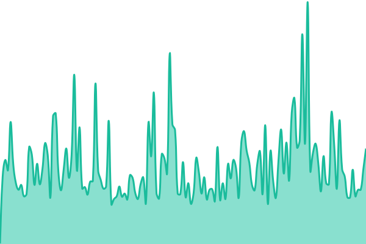 139ms
     
 | 

<a href="https://TW641.github.io/status/history/tw-641-status-cloudflare-pages">100.00%</a>
    

|  [TW641 Uptimer - Cloudflare Pages](https://tw641uptimer.pages.dev/) | 🟩 Up | [tw-641-uptimer-cloudflare-pages.yml](https://github.com/TW641/status/commits/HEAD/history/tw-641-uptimer-cloudflare-pages.yml) | 

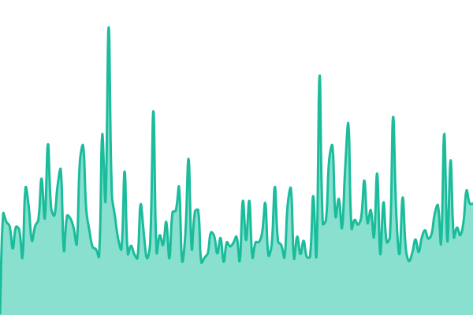 136ms
     
 | 

<a href="https://TW641.github.io/status/history/tw-641-uptimer-cloudflare-pages">100.00%</a>
    

|  [TW641 Status - GitHub Pages](https://tw641.github.io/status/) | 🟩 Up | [tw-641-status-git-hub-pages.yml](https://github.com/TW641/status/commits/HEAD/history/tw-641-status-git-hub-pages.yml) | 

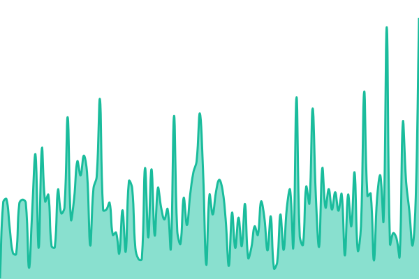 108ms
     
 | 

<a href="https://TW641.github.io/status/history/tw-641-status-git-hub-pages">100.00%</a>
    

|  [TW641 GitHub Pages 官方主站 - 首頁](https://tw641.github.io/) | 🟩 Up | [tw-641-git-hub-pages.yml](https://github.com/TW641/status/commits/HEAD/history/tw-641-git-hub-pages.yml) | 

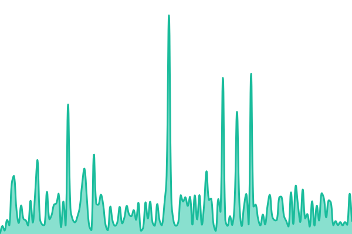 103ms
     
 | 

<a href="https://TW641.github.io/status/history/tw-641-git-hub-pages">100.00%</a>
    

|  [TW641 GitHub Pages 官方主站 - daves-guitar-2026](https://tw641.github.io/daves-guitar-2026/) | 🟩 Up | [tw-641-git-hub-pages-daves-guitar-2026.yml](https://github.com/TW641/status/commits/HEAD/history/tw-641-git-hub-pages-daves-guitar-2026.yml) | 

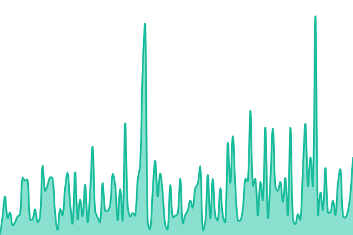 94ms
     
 | 

<a href="https://TW641.github.io/status/history/tw-641-git-hub-pages-daves-guitar-2026">100.00%</a>
    

|  [TW641 GitHub Pages 官方主站 - Padavan-CAKE](https://tw641.github.io/Padavan-CAKE/) | 🟩 Up | [tw-641-git-hub-pages-padavan-cake.yml](https://github.com/TW641/status/commits/HEAD/history/tw-641-git-hub-pages-padavan-cake.yml) | 

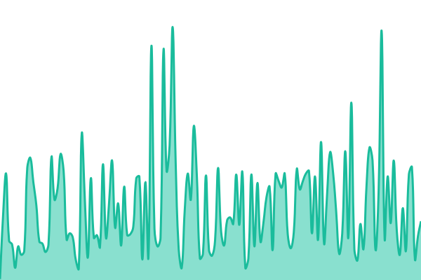 75ms
     
 | 

<a href="https://TW641.github.io/status/history/tw-641-git-hub-pages-padavan-cake">100.00%</a>
    

|  [TW641 GitHub Pages 官方主站 - sch_cake](https://tw641.github.io/sch_cake/) | 🟩 Up | [tw-641-git-hub-pages-sch-cake.yml](https://github.com/TW641/status/commits/HEAD/history/tw-641-git-hub-pages-sch-cake.yml) | 

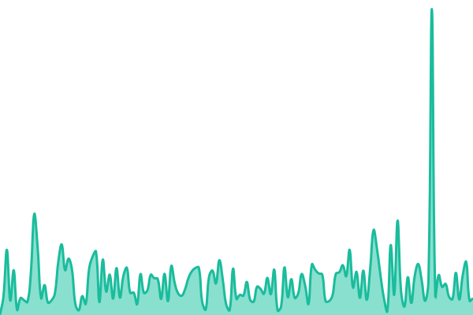 97ms
     
 | 

<a href="https://TW641.github.io/status/history/tw-641-git-hub-pages-sch-cake">100.00%</a>
    

|  [TW641 GitHub Pages 官方主站 - padavan-builder-workflow](https://tw641.github.io/padavan-builder-workflow/) | 🟩 Up | [tw-641-git-hub-pages-padavan-builder-workflow.yml](https://github.com/TW641/status/commits/HEAD/history/tw-641-git-hub-pages-padavan-builder-workflow.yml) | 

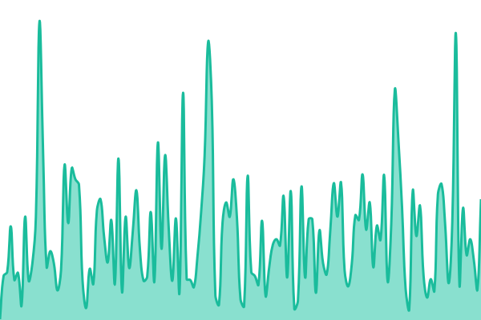 105ms
     
 | 

<a href="https://TW641.github.io/status/history/tw-641-git-hub-pages-padavan-builder-workflow">100.00%</a>
    

|  [TW641 GitHub Pages 官方主站 - padavan-ng](https://tw641.github.io/padavan-ng/) | 🟩 Up | [tw-641-git-hub-pages-padavan-ng.yml](https://github.com/TW641/status/commits/HEAD/history/tw-641-git-hub-pages-padavan-ng.yml) | 

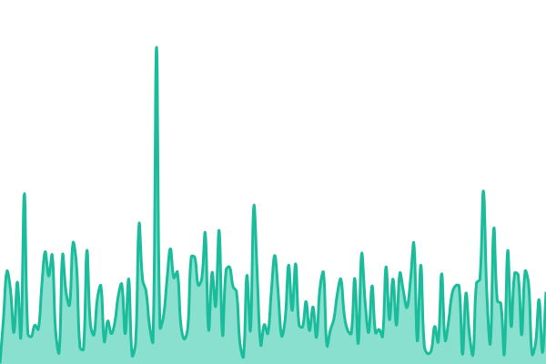 101ms
     
 | 

<a href="https://TW641.github.io/status/history/tw-641-git-hub-pages-padavan-ng">100.00%</a>
    

|  [TW641 GitHub Pages 官方主站 - padavan-4.4](https://tw641.github.io/padavan-4.4/) | 🟩 Up | [tw-641-git-hub-pages-padavan-4-4.yml](https://github.com/TW641/status/commits/HEAD/history/tw-641-git-hub-pages-padavan-4-4.yml) | 

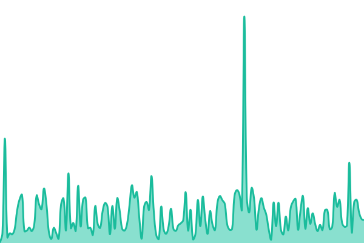 98ms
     
 | 

<a href="https://TW641.github.io/status/history/tw-641-git-hub-pages-padavan-4-4">100.00%</a>
    

|  [TW641 Cloudflare Pages 備援網站 - 首頁](https://tw641.pages.dev/) | 🟩 Up | [tw-641-cloudflare-pages.yml](https://github.com/TW641/status/commits/HEAD/history/tw-641-cloudflare-pages.yml) | 

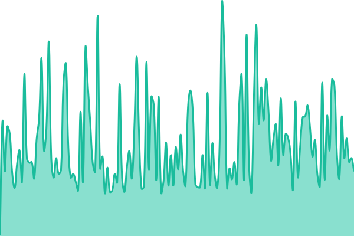 112ms
     
 | 

<a href="https://TW641.github.io/status/history/tw-641-cloudflare-pages">100.00%</a>
    

|  [TW641 Cloudflare Pages 備援網站 - daves-guitar-2026](https://tw641.pages.dev/daves-guitar-2026/) | 🟩 Up | [tw-641-cloudflare-pages-daves-guitar-2026.yml](https://github.com/TW641/status/commits/HEAD/history/tw-641-cloudflare-pages-daves-guitar-2026.yml) | 

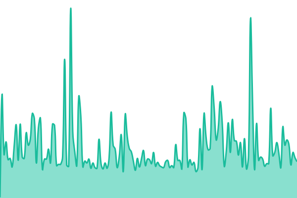 74ms
     
 | 

<a href="https://TW641.github.io/status/history/tw-641-cloudflare-pages-daves-guitar-2026">100.00%</a>
    

|  [TW641 Cloudflare Pages 備援網站 - Padavan-CAKE](https://tw641.pages.dev/Padavan-CAKE/) | 🟩 Up | [tw-641-cloudflare-pages-padavan-cake.yml](https://github.com/TW641/status/commits/HEAD/history/tw-641-cloudflare-pages-padavan-cake.yml) | 

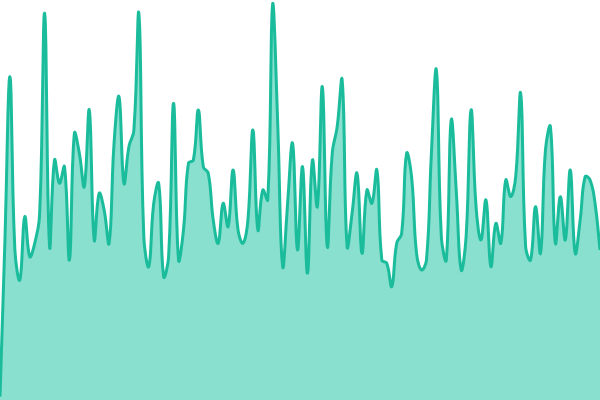 67ms
     
 | 

<a href="https://TW641.github.io/status/history/tw-641-cloudflare-pages-padavan-cake">100.00%</a>
    

|  [TW641 Cloudflare Pages 備援網站 - sch_cake](https://tw641.pages.dev/sch_cake/) | 🟩 Up | [tw-641-cloudflare-pages-sch-cake.yml](https://github.com/TW641/status/commits/HEAD/history/tw-641-cloudflare-pages-sch-cake.yml) | 

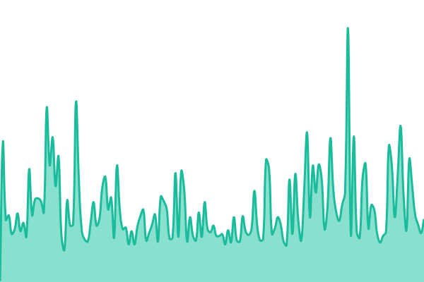 74ms
     
 | 

<a href="https://TW641.github.io/status/history/tw-641-cloudflare-pages-sch-cake">100.00%</a>
    

|  [TW641 Cloudflare Pages 備援網站 - padavan-builder-workflow](https://tw641.pages.dev/padavan-builder-workflow/) | 🟩 Up | [tw-641-cloudflare-pages-padavan-builder-workflow.yml](https://github.com/TW641/status/commits/HEAD/history/tw-641-cloudflare-pages-padavan-builder-workflow.yml) | 

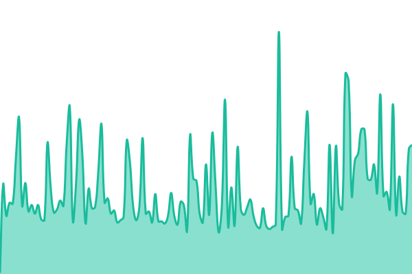 73ms
     
 | 

<a href="https://TW641.github.io/status/history/tw-641-cloudflare-pages-padavan-builder-workflow">100.00%</a>
    

|  [TW641 Cloudflare Pages 備援網站 - padavan-ng](https://tw641.pages.dev/padavan-ng/) | 🟩 Up | [tw-641-cloudflare-pages-padavan-ng.yml](https://github.com/TW641/status/commits/HEAD/history/tw-641-cloudflare-pages-padavan-ng.yml) | 

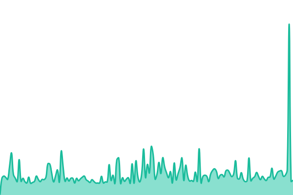 71ms
     
 | 

<a href="https://TW641.github.io/status/history/tw-641-cloudflare-pages-padavan-ng">100.00%</a>
    

|  [TW641 Cloudflare Pages 備援網站 - padavan-4.4](https://tw641.pages.dev/padavan-4.4/) | 🟩 Up | [tw-641-cloudflare-pages-padavan-4-4.yml](https://github.com/TW641/status/commits/HEAD/history/tw-641-cloudflare-pages-padavan-4-4.yml) | 

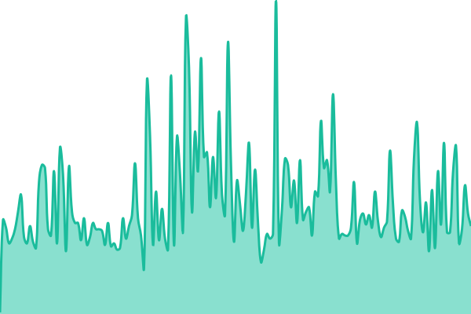 70ms
     
 | 

<a href="https://TW641.github.io/status/history/tw-641-cloudflare-pages-padavan-4-4">100.00%</a>
    

|  [TW641 Cloudflare Workers 備援網站 - 首頁](https://www.tw641.workers.dev/) | 🟩 Up | [tw-641-cloudflare-workers.yml](https://github.com/TW641/status/commits/HEAD/history/tw-641-cloudflare-workers.yml) | 

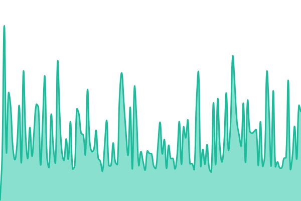 110ms
     
 | 

<a href="https://TW641.github.io/status/history/tw-641-cloudflare-workers">100.00%</a>
    

|  [TW641 Cloudflare Workers 備援網站 - daves-guitar-2026](https://www.tw641.workers.dev/daves-guitar-2026/) | 🟩 Up | [tw-641-cloudflare-workers-daves-guitar-2026.yml](https://github.com/TW641/status/commits/HEAD/history/tw-641-cloudflare-workers-daves-guitar-2026.yml) | 

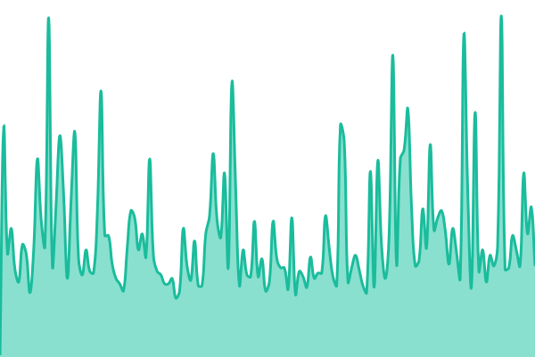 67ms
     
 | 

<a href="https://TW641.github.io/status/history/tw-641-cloudflare-workers-daves-guitar-2026">100.00%</a>
    

|  [TW641 Cloudflare Workers 備援網站 - Padavan-CAKE](https://www.tw641.workers.dev/Padavan-CAKE/) | 🟩 Up | [tw-641-cloudflare-workers-padavan-cake.yml](https://github.com/TW641/status/commits/HEAD/history/tw-641-cloudflare-workers-padavan-cake.yml) | 

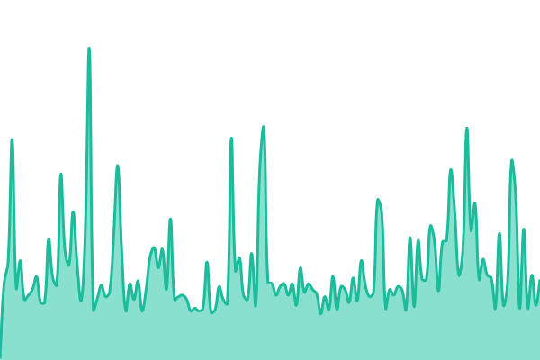 61ms
     
 | 

<a href="https://TW641.github.io/status/history/tw-641-cloudflare-workers-padavan-cake">100.00%</a>
    

|  [TW641 Cloudflare Workers 備援網站 - sch_cake](https://www.tw641.workers.dev/sch_cake/) | 🟩 Up | [tw-641-cloudflare-workers-sch-cake.yml](https://github.com/TW641/status/commits/HEAD/history/tw-641-cloudflare-workers-sch-cake.yml) | 

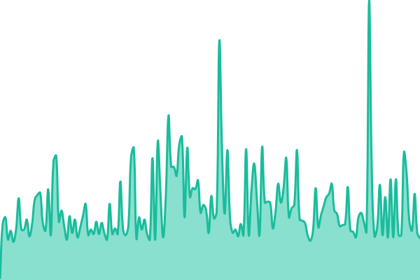 65ms
     
 | 

<a href="https://TW641.github.io/status/history/tw-641-cloudflare-workers-sch-cake">100.00%</a>
    

|  [TW641 Cloudflare Workers 備援網站 - padavan-builder-workflow](https://www.tw641.workers.dev/padavan-builder-workflow/) | 🟩 Up | [tw-641-cloudflare-workers-padavan-builder-workflow.yml](https://github.com/TW641/status/commits/HEAD/history/tw-641-cloudflare-workers-padavan-builder-workflow.yml) | 

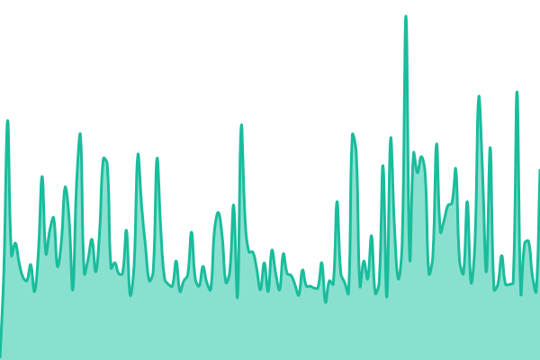 62ms
     
 | 

<a href="https://TW641.github.io/status/history/tw-641-cloudflare-workers-padavan-builder-workflow">100.00%</a>
    

|  [TW641 Cloudflare Workers 備援網站 - padavan-ng](https://www.tw641.workers.dev/padavan-ng/) | 🟩 Up | [tw-641-cloudflare-workers-padavan-ng.yml](https://github.com/TW641/status/commits/HEAD/history/tw-641-cloudflare-workers-padavan-ng.yml) | 

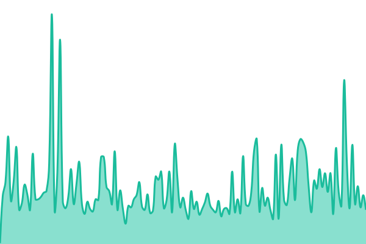 67ms
     
 | 

<a href="https://TW641.github.io/status/history/tw-641-cloudflare-workers-padavan-ng">100.00%</a>
    

|  [TW641 Cloudflare Workers 備援網站 - padavan-4.4](https://www.tw641.workers.dev/padavan-4.4/) | 🟩 Up | [tw-641-cloudflare-workers-padavan-4-4.yml](https://github.com/TW641/status/commits/HEAD/history/tw-641-cloudflare-workers-padavan-4-4.yml) | 

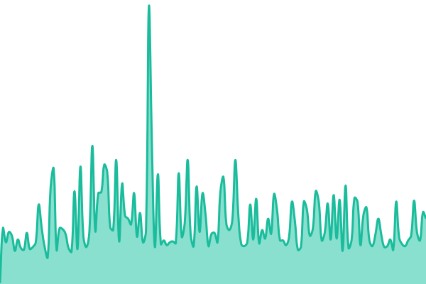 65ms
     
 | 

<a href="https://TW641.github.io/status/history/tw-641-cloudflare-workers-padavan-4-4">100.00%</a>
    

|  [TW641 Firebase Hosting 備援網站 - 首頁](https://tw641t.web.app/) | 🟩 Up | [tw-641-firebase-hosting.yml](https://github.com/TW641/status/commits/HEAD/history/tw-641-firebase-hosting.yml) | 

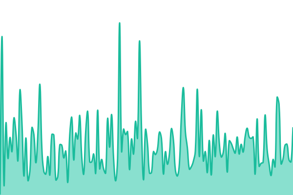 106ms
     
 | 

<a href="https://TW641.github.io/status/history/tw-641-firebase-hosting">100.00%</a>
    

|  [TW641 Firebase Hosting 備援網站 - daves-guitar-2026](https://tw641t.web.app/daves-guitar-2026/) | 🟩 Up | [tw-641-firebase-hosting-daves-guitar-2026.yml](https://github.com/TW641/status/commits/HEAD/history/tw-641-firebase-hosting-daves-guitar-2026.yml) | 

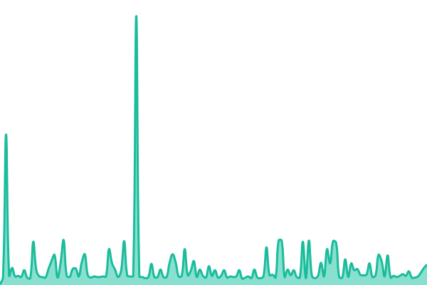 32ms
     
 | 

<a href="https://TW641.github.io/status/history/tw-641-firebase-hosting-daves-guitar-2026">100.00%</a>
    

|  [TW641 Firebase Hosting 備援網站 - Padavan-CAKE](https://tw641t.web.app/Padavan-CAKE/) | 🟩 Up | [tw-641-firebase-hosting-padavan-cake.yml](https://github.com/TW641/status/commits/HEAD/history/tw-641-firebase-hosting-padavan-cake.yml) | 

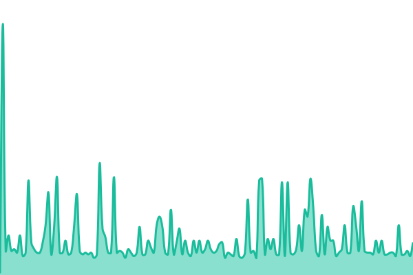 22ms
     
 | 

<a href="https://TW641.github.io/status/history/tw-641-firebase-hosting-padavan-cake">100.00%</a>
    

|  [TW641 Firebase Hosting 備援網站 - sch_cake](https://tw641t.web.app/sch_cake/) | 🟩 Up | [tw-641-firebase-hosting-sch-cake.yml](https://github.com/TW641/status/commits/HEAD/history/tw-641-firebase-hosting-sch-cake.yml) | 

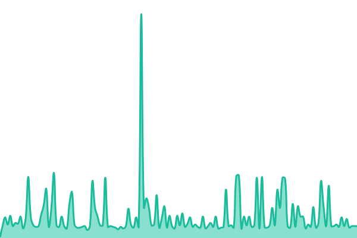 28ms
     
 | 

<a href="https://TW641.github.io/status/history/tw-641-firebase-hosting-sch-cake">100.00%</a>
    

|  [TW641 Firebase Hosting 備援網站 - padavan-builder-workflow](https://tw641t.web.app/padavan-builder-workflow/) | 🟩 Up | [tw-641-firebase-hosting-padavan-builder-workflow.yml](https://github.com/TW641/status/commits/HEAD/history/tw-641-firebase-hosting-padavan-builder-workflow.yml) | 

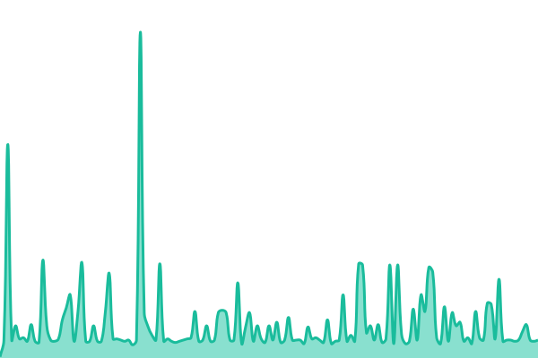 36ms
     
 | 

<a href="https://TW641.github.io/status/history/tw-641-firebase-hosting-padavan-builder-workflow">100.00%</a>
    

|  [TW641 Firebase Hosting 備援網站 - padavan-ng](https://tw641t.web.app/padavan-ng/) | 🟩 Up | [tw-641-firebase-hosting-padavan-ng.yml](https://github.com/TW641/status/commits/HEAD/history/tw-641-firebase-hosting-padavan-ng.yml) | 

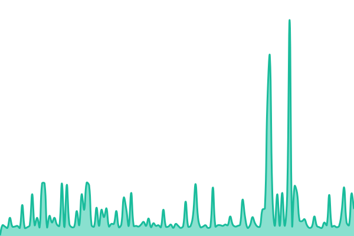 27ms
     
 | 

<a href="https://TW641.github.io/status/history/tw-641-firebase-hosting-padavan-ng">100.00%</a>
    

|  [TW641 Firebase Hosting 備援網站 - padavan-4.4](https://tw641t.web.app/padavan-4.4/) | 🟩 Up | [tw-641-firebase-hosting-padavan-4-4.yml](https://github.com/TW641/status/commits/HEAD/history/tw-641-firebase-hosting-padavan-4-4.yml) | 

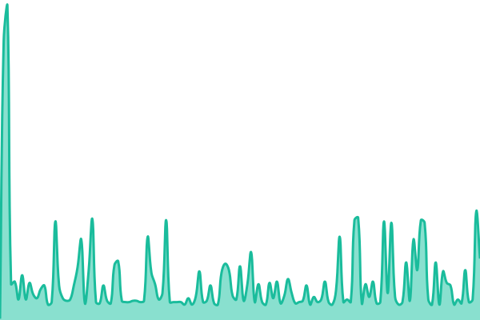 29ms
     
 | 

<a href="https://TW641.github.io/status/history/tw-641-firebase-hosting-padavan-4-4">100.00%</a>
    

|  [TW641 FirebaseApp.com 備用網域 - 首頁](https://tw641t.firebaseapp.com/) | 🟩 Up | [tw-641-firebase-app-com.yml](https://github.com/TW641/status/commits/HEAD/history/tw-641-firebase-app-com.yml) | 

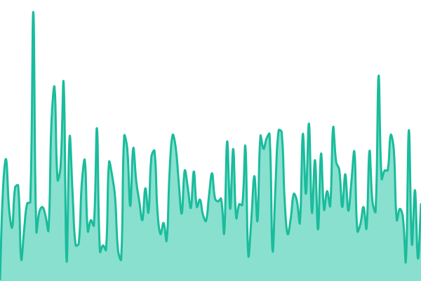 102ms
     
 | 

<a href="https://TW641.github.io/status/history/tw-641-firebase-app-com">100.00%</a>
    

|  [TW641 FirebaseApp.com 備用網域 - daves-guitar-2026](https://tw641t.firebaseapp.com/daves-guitar-2026/) | 🟩 Up | [tw-641-firebase-app-com-daves-guitar-2026.yml](https://github.com/TW641/status/commits/HEAD/history/tw-641-firebase-app-com-daves-guitar-2026.yml) | 

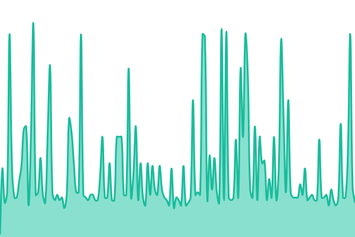 29ms
     
 | 

<a href="https://TW641.github.io/status/history/tw-641-firebase-app-com-daves-guitar-2026">100.00%</a>
    

|  [TW641 FirebaseApp.com 備用網域 - Padavan-CAKE](https://tw641t.firebaseapp.com/Padavan-CAKE/) | 🟩 Up | [tw-641-firebase-app-com-padavan-cake.yml](https://github.com/TW641/status/commits/HEAD/history/tw-641-firebase-app-com-padavan-cake.yml) | 

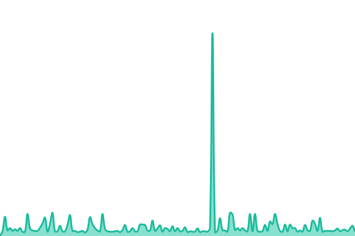 20ms
     
 | 

<a href="https://TW641.github.io/status/history/tw-641-firebase-app-com-padavan-cake">100.00%</a>
    

|  [TW641 FirebaseApp.com 備用網域 - sch_cake](https://tw641t.firebaseapp.com/sch_cake/) | 🟩 Up | [tw-641-firebase-app-com-sch-cake.yml](https://github.com/TW641/status/commits/HEAD/history/tw-641-firebase-app-com-sch-cake.yml) | 

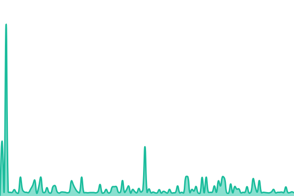 40ms
     
 | 

<a href="https://TW641.github.io/status/history/tw-641-firebase-app-com-sch-cake">100.00%</a>
    

|  [TW641 FirebaseApp.com 備用網域 - padavan-builder-workflow](https://tw641t.firebaseapp.com/padavan-builder-workflow/) | 🟩 Up | [tw-641-firebase-app-com-padavan-builder-workflow.yml](https://github.com/TW641/status/commits/HEAD/history/tw-641-firebase-app-com-padavan-builder-workflow.yml) | 

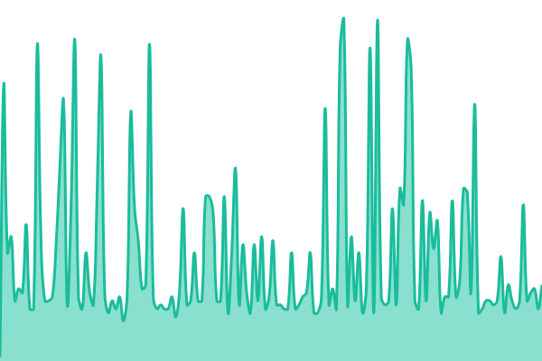 26ms
     
 | 

<a href="https://TW641.github.io/status/history/tw-641-firebase-app-com-padavan-builder-workflow">100.00%</a>
    

|  [TW641 FirebaseApp.com 備用網域 - padavan-ng](https://tw641t.firebaseapp.com/padavan-ng/) | 🟩 Up | [tw-641-firebase-app-com-padavan-ng.yml](https://github.com/TW641/status/commits/HEAD/history/tw-641-firebase-app-com-padavan-ng.yml) | 

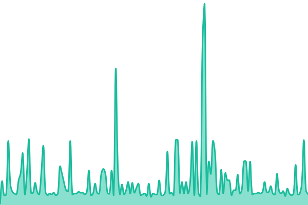 29ms
     
 | 

<a href="https://TW641.github.io/status/history/tw-641-firebase-app-com-padavan-ng">100.00%</a>
    

|  [TW641 FirebaseApp.com 備用網域 - padavan-4.4](https://tw641t.firebaseapp.com/padavan-4.4/) | 🟩 Up | [tw-641-firebase-app-com-padavan-4-4.yml](https://github.com/TW641/status/commits/HEAD/history/tw-641-firebase-app-com-padavan-4-4.yml) | 

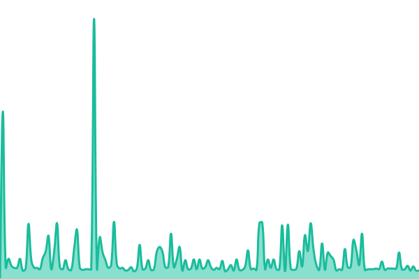 353ms
     
 | 

<a href="https://TW641.github.io/status/history/tw-641-firebase-app-com-padavan-4-4">100.00%</a>
    

|  [TW641 GitLab Pages 備援網站 - 首頁](https://tw641.gitlab.io/) | 🟩 Up | [tw-641-git-lab-pages.yml](https://github.com/TW641/status/commits/HEAD/history/tw-641-git-lab-pages.yml) | 

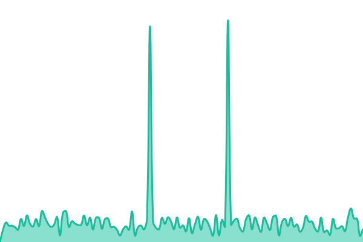 427ms
     
 | 

<a href="https://TW641.github.io/status/history/tw-641-git-lab-pages">100.00%</a>
    

|  [TW641 GitLab Pages 備援網站 - daves-guitar-2026](https://tw641.gitlab.io/daves-guitar-2026/) | 🟩 Up | [tw-641-git-lab-pages-daves-guitar-2026.yml](https://github.com/TW641/status/commits/HEAD/history/tw-641-git-lab-pages-daves-guitar-2026.yml) | 

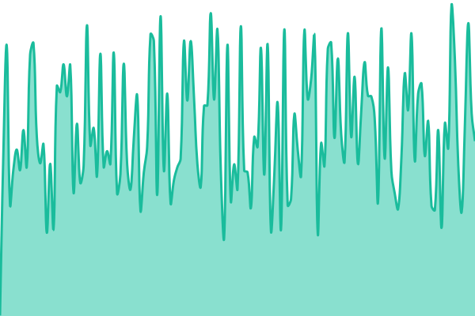 341ms
     
 | 

<a href="https://TW641.github.io/status/history/tw-641-git-lab-pages-daves-guitar-2026">100.00%</a>
    

|  [TW641 GitLab Pages 備援網站 - Padavan-CAKE](https://tw641.gitlab.io/Padavan-CAKE/) | 🟩 Up | [tw-641-git-lab-pages-padavan-cake.yml](https://github.com/TW641/status/commits/HEAD/history/tw-641-git-lab-pages-padavan-cake.yml) | 

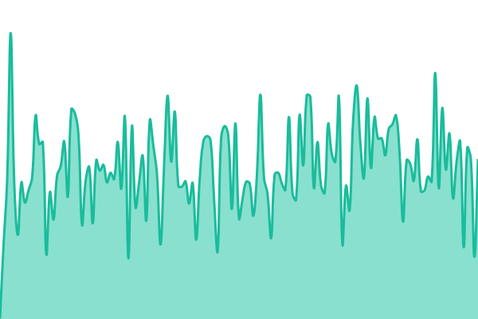 269ms
     
 | 

<a href="https://TW641.github.io/status/history/tw-641-git-lab-pages-padavan-cake">100.00%</a>
    

|  [TW641 GitLab Pages 備援網站 - sch_cake](https://tw641.gitlab.io/sch_cake/) | 🟩 Up | [tw-641-git-lab-pages-sch-cake.yml](https://github.com/TW641/status/commits/HEAD/history/tw-641-git-lab-pages-sch-cake.yml) | 

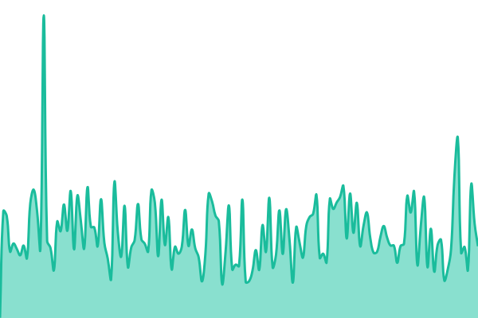 363ms
     
 | 

<a href="https://TW641.github.io/status/history/tw-641-git-lab-pages-sch-cake">100.00%</a>
    

|  [TW641 GitLab Pages 備援網站 - padavan-builder-workflow](https://tw641.gitlab.io/padavan-builder-workflow/) | 🟩 Up | [tw-641-git-lab-pages-padavan-builder-workflow.yml](https://github.com/TW641/status/commits/HEAD/history/tw-641-git-lab-pages-padavan-builder-workflow.yml) | 

 334ms
     
 | 

<a href="https://TW641.github.io/status/history/tw-641-git-lab-pages-padavan-builder-workflow">100.00%</a>
    

|  [TW641 GitLab Pages 備援網站 - padavan-ng](https://tw641.gitlab.io/padavan-ng/) | 🟩 Up | [tw-641-git-lab-pages-padavan-ng.yml](https://github.com/TW641/status/commits/HEAD/history/tw-641-git-lab-pages-padavan-ng.yml) | 

 342ms
     
 | 

<a href="https://TW641.github.io/status/history/tw-641-git-lab-pages-padavan-ng">100.00%</a>
    

|  [TW641 GitLab Pages 備援網站 - padavan-4.4](https://tw641.gitlab.io/padavan-4.4/) | 🟩 Up | [tw-641-git-lab-pages-padavan-4-4.yml](https://github.com/TW641/status/commits/HEAD/history/tw-641-git-lab-pages-padavan-4-4.yml) | 

 326ms
     
 | 

<a href="https://TW641.github.io/status/history/tw-641-git-lab-pages-padavan-4-4">100.00%</a>
    

|  [TW641 Netlify 備援網站 - 首頁](https://tw641.netlify.app/) | 🟩 Up | [tw-641-netlify.yml](https://github.com/TW641/status/commits/HEAD/history/tw-641-netlify.yml) | 

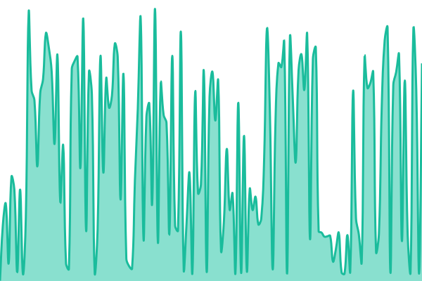 441ms
     
 | 

<a href="https://TW641.github.io/status/history/tw-641-netlify">100.00%</a>
    

|  [TW641 Netlify 備援網站 - daves-guitar-2026](https://tw641.netlify.app/daves-guitar-2026/) | 🟩 Up | [tw-641-netlify-daves-guitar-2026.yml](https://github.com/TW641/status/commits/HEAD/history/tw-641-netlify-daves-guitar-2026.yml) | 

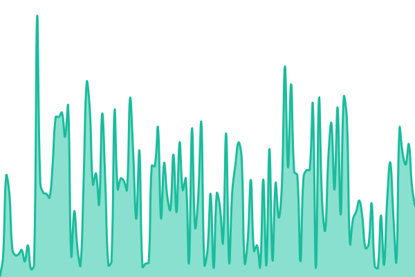 158ms
     
 | 

<a href="https://TW641.github.io/status/history/tw-641-netlify-daves-guitar-2026">100.00%</a>
    

|  [TW641 Netlify 備援網站 - Padavan-CAKE](https://tw641.netlify.app/Padavan-CAKE/) | 🟩 Up | [tw-641-netlify-padavan-cake.yml](https://github.com/TW641/status/commits/HEAD/history/tw-641-netlify-padavan-cake.yml) | 

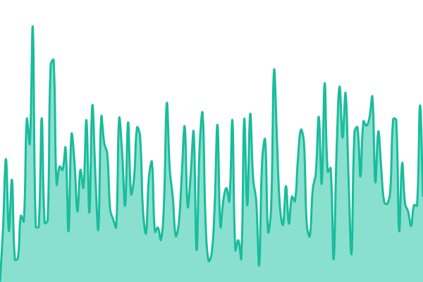 363ms
     
 | 

<a href="https://TW641.github.io/status/history/tw-641-netlify-padavan-cake">100.00%</a>
    

|  [TW641 Netlify 備援網站 - sch_cake](https://tw641.netlify.app/sch_cake/) | 🟩 Up | [tw-641-netlify-sch-cake.yml](https://github.com/TW641/status/commits/HEAD/history/tw-641-netlify-sch-cake.yml) | 

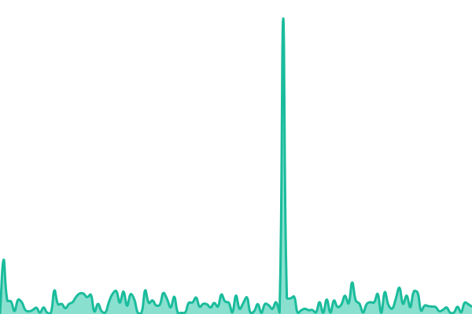 212ms
     
 | 

<a href="https://TW641.github.io/status/history/tw-641-netlify-sch-cake">100.00%</a>
    

|  [TW641 Netlify 備援網站 - padavan-builder-workflow](https://tw641.netlify.app/padavan-builder-workflow/) | 🟩 Up | [tw-641-netlify-padavan-builder-workflow.yml](https://github.com/TW641/status/commits/HEAD/history/tw-641-netlify-padavan-builder-workflow.yml) | 

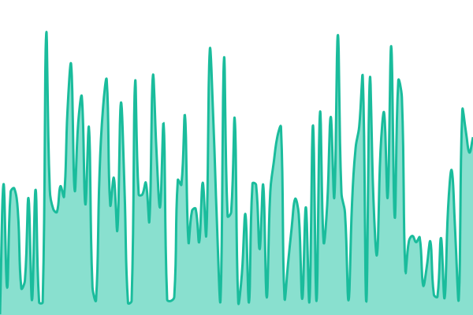 170ms
     
 | 

<a href="https://TW641.github.io/status/history/tw-641-netlify-padavan-builder-workflow">100.00%</a>
    

|  [TW641 Netlify 備援網站 - padavan-ng](https://tw641.netlify.app/padavan-ng/) | 🟩 Up | [tw-641-netlify-padavan-ng.yml](https://github.com/TW641/status/commits/HEAD/history/tw-641-netlify-padavan-ng.yml) | 

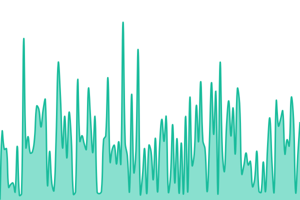 167ms
     
 | 

<a href="https://TW641.github.io/status/history/tw-641-netlify-padavan-ng">100.00%</a>
    

|  [TW641 Netlify 備援網站 - padavan-4.4](https://tw641.netlify.app/padavan-4.4/) | 🟩 Up | [tw-641-netlify-padavan-4-4.yml](https://github.com/TW641/status/commits/HEAD/history/tw-641-netlify-padavan-4-4.yml) | 

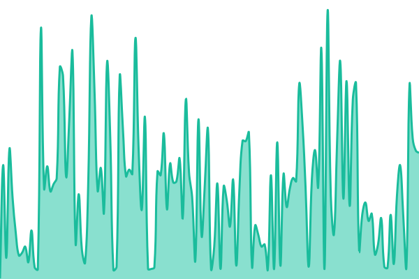 169ms
     
 | 

<a href="https://TW641.github.io/status/history/tw-641-netlify-padavan-4-4">100.00%</a>
    

|  [TW641 Vercel 備援網站 - 首頁](https://tw641.vercel.app/) | 🟩 Up | [tw-641-vercel.yml](https://github.com/TW641/status/commits/HEAD/history/tw-641-vercel.yml) | 

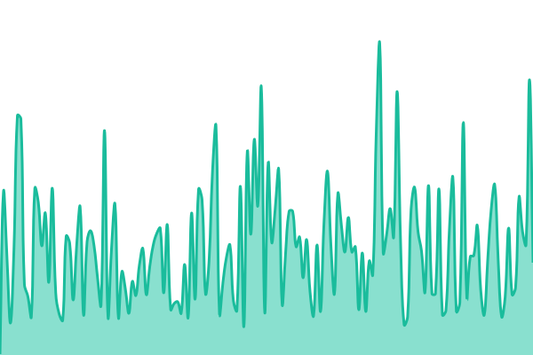 118ms
     
 | 

<a href="https://TW641.github.io/status/history/tw-641-vercel">100.00%</a>
    

|  [TW641 Vercel 備援網站 - daves-guitar-2026](https://tw641.vercel.app/daves-guitar-2026/) | 🟩 Up | [tw-641-vercel-daves-guitar-2026.yml](https://github.com/TW641/status/commits/HEAD/history/tw-641-vercel-daves-guitar-2026.yml) | 

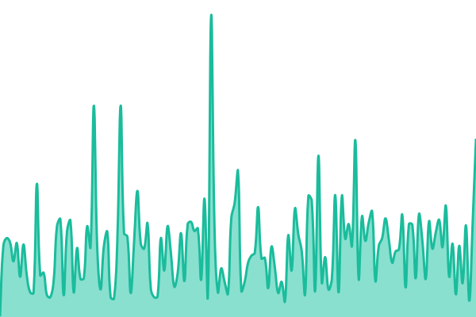 95ms
     
 | 

<a href="https://TW641.github.io/status/history/tw-641-vercel-daves-guitar-2026">100.00%</a>
    

|  [TW641 Vercel 備援網站 - Padavan-CAKE](https://tw641.vercel.app/Padavan-CAKE/) | 🟩 Up | [tw-641-vercel-padavan-cake.yml](https://github.com/TW641/status/commits/HEAD/history/tw-641-vercel-padavan-cake.yml) | 

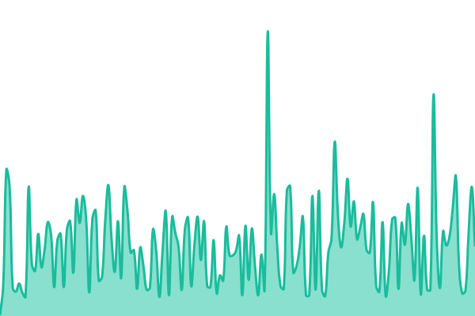 74ms
     
 | 

<a href="https://TW641.github.io/status/history/tw-641-vercel-padavan-cake">100.00%</a>
    

|  [TW641 Vercel 備援網站 - sch_cake](https://tw641.vercel.app/sch_cake/) | 🟩 Up | [tw-641-vercel-sch-cake.yml](https://github.com/TW641/status/commits/HEAD/history/tw-641-vercel-sch-cake.yml) | 

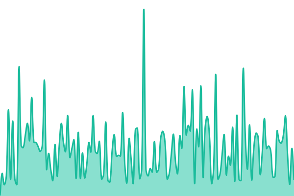 84ms
     
 | 

<a href="https://TW641.github.io/status/history/tw-641-vercel-sch-cake">100.00%</a>
    

|  [TW641 Vercel 備援網站 - padavan-builder-workflow](https://tw641.vercel.app/padavan-builder-workflow/) | 🟩 Up | [tw-641-vercel-padavan-builder-workflow.yml](https://github.com/TW641/status/commits/HEAD/history/tw-641-vercel-padavan-builder-workflow.yml) | 

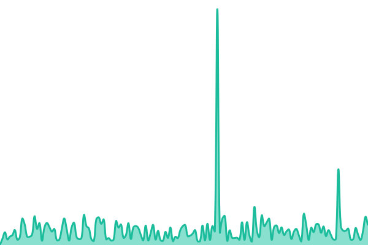 84ms
     
 | 

<a href="https://TW641.github.io/status/history/tw-641-vercel-padavan-builder-workflow">100.00%</a>
    

|  [TW641 Vercel 備援網站 - padavan-ng](https://tw641.vercel.app/padavan-ng/) | 🟩 Up | [tw-641-vercel-padavan-ng.yml](https://github.com/TW641/status/commits/HEAD/history/tw-641-vercel-padavan-ng.yml) | 

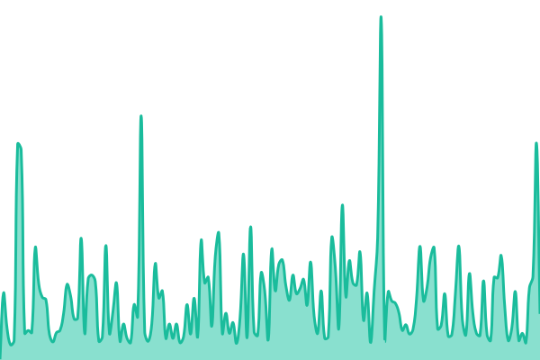 84ms
     
 | 

<a href="https://TW641.github.io/status/history/tw-641-vercel-padavan-ng">100.00%</a>
    

|  [TW641 Vercel 備援網站 - padavan-4.4](https://tw641.vercel.app/padavan-4.4/) | 🟩 Up | [tw-641-vercel-padavan-4-4.yml](https://github.com/TW641/status/commits/HEAD/history/tw-641-vercel-padavan-4-4.yml) | 

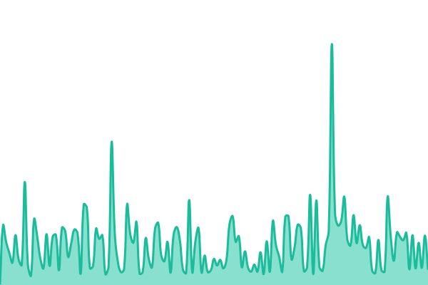 80ms
     
 | 

<a href="https://TW641.github.io/status/history/tw-641-vercel-padavan-4-4">100.00%</a>
    

|  [TW641 Render 備援網站 - 首頁](https://tw641.onrender.com/) | 🟩 Up | [tw-641-render.yml](https://github.com/TW641/status/commits/HEAD/history/tw-641-render.yml) | 

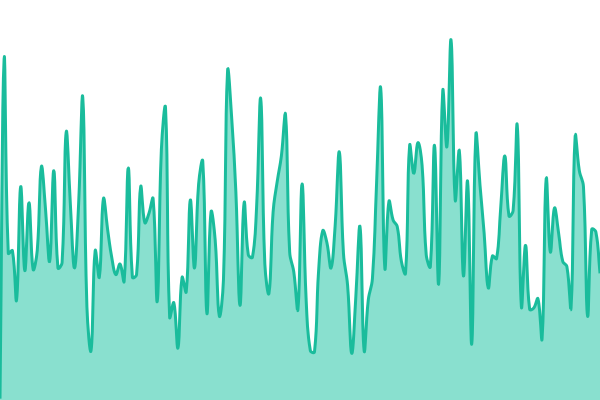 127ms
     
 | 

<a href="https://TW641.github.io/status/history/tw-641-render">100.00%</a>
    

|  [TW641 Render 備援網站 - daves-guitar-2026](https://tw641.onrender.com/daves-guitar-2026/) | 🟩 Up | [tw-641-render-daves-guitar-2026.yml](https://github.com/TW641/status/commits/HEAD/history/tw-641-render-daves-guitar-2026.yml) | 

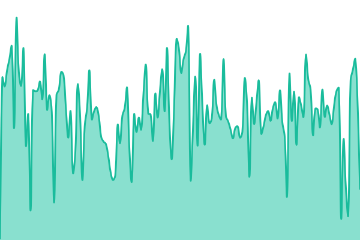 185ms
     
 | 

<a href="https://TW641.github.io/status/history/tw-641-render-daves-guitar-2026">100.00%</a>
    

|  [TW641 Render 備援網站 - Padavan-CAKE](https://tw641.onrender.com/Padavan-CAKE/) | 🟩 Up | [tw-641-render-padavan-cake.yml](https://github.com/TW641/status/commits/HEAD/history/tw-641-render-padavan-cake.yml) | 

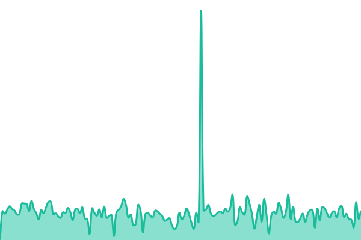 157ms
     
 | 

<a href="https://TW641.github.io/status/history/tw-641-render-padavan-cake">100.00%</a>
    

|  [TW641 Render 備援網站 - sch_cake](https://tw641.onrender.com/sch_cake/) | 🟩 Up | [tw-641-render-sch-cake.yml](https://github.com/TW641/status/commits/HEAD/history/tw-641-render-sch-cake.yml) | 

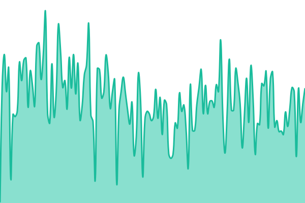 192ms
     
 | 

<a href="https://TW641.github.io/status/history/tw-641-render-sch-cake">100.00%</a>
    

|  [TW641 Render 備援網站 - padavan-builder-workflow](https://tw641.onrender.com/padavan-builder-workflow/) | 🟩 Up | [tw-641-render-padavan-builder-workflow.yml](https://github.com/TW641/status/commits/HEAD/history/tw-641-render-padavan-builder-workflow.yml) | 

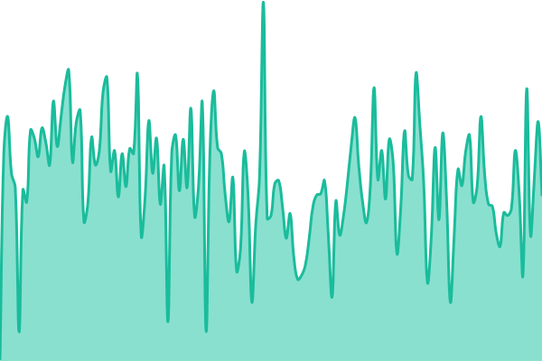 192ms
     
 | 

<a href="https://TW641.github.io/status/history/tw-641-render-padavan-builder-workflow">100.00%</a>
    

|  [TW641 Render 備援網站 - padavan-ng](https://tw641.onrender.com/padavan-ng/) | 🟩 Up | [tw-641-render-padavan-ng.yml](https://github.com/TW641/status/commits/HEAD/history/tw-641-render-padavan-ng.yml) | 

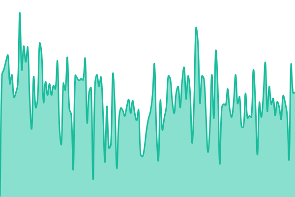 185ms
     
 | 

<a href="https://TW641.github.io/status/history/tw-641-render-padavan-ng">100.00%</a>
    

|  [TW641 Render 備援網站 - padavan-4.4](https://tw641.onrender.com/padavan-4.4/) | 🟩 Up | [tw-641-render-padavan-4-4.yml](https://github.com/TW641/status/commits/HEAD/history/tw-641-render-padavan-4-4.yml) | 

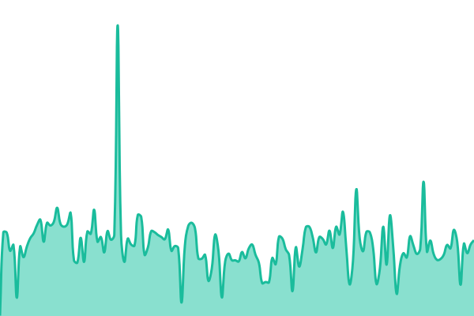 192ms
     
 | 

<a href="https://TW641.github.io/status/history/tw-641-render-padavan-4-4">100.00%</a>
    

|  [TW641 Surge 備援網站 - 首頁](https://tw641.surge.sh/) | 🟩 Up | [tw-641-surge.yml](https://github.com/TW641/status/commits/HEAD/history/tw-641-surge.yml) | 

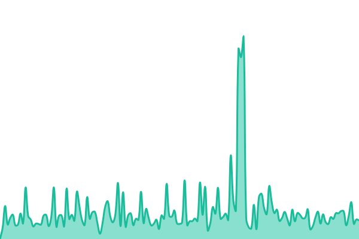 565ms
     
 | 

<a href="https://TW641.github.io/status/history/tw-641-surge">100.00%</a>
    

|  [TW641 Surge 備援網站 - daves-guitar-2026](https://tw641.surge.sh/daves-guitar-2026/) | 🟩 Up | [tw-641-surge-daves-guitar-2026.yml](https://github.com/TW641/status/commits/HEAD/history/tw-641-surge-daves-guitar-2026.yml) | 

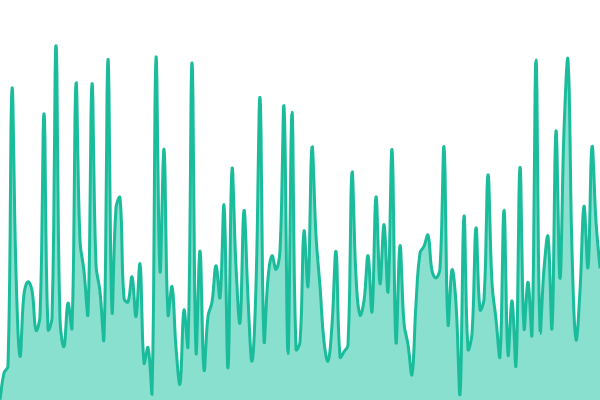 421ms
     
 | 

<a href="https://TW641.github.io/status/history/tw-641-surge-daves-guitar-2026">100.00%</a>
    

|  [TW641 Surge 備援網站 - Padavan-CAKE](https://tw641.surge.sh/Padavan-CAKE/) | 🟩 Up | [tw-641-surge-padavan-cake.yml](https://github.com/TW641/status/commits/HEAD/history/tw-641-surge-padavan-cake.yml) | 

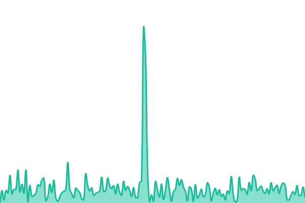 365ms
     
 | 

<a href="https://TW641.github.io/status/history/tw-641-surge-padavan-cake">100.00%</a>
    

|  [TW641 Surge 備援網站 - sch_cake](https://tw641.surge.sh/sch_cake/) | 🟩 Up | [tw-641-surge-sch-cake.yml](https://github.com/TW641/status/commits/HEAD/history/tw-641-surge-sch-cake.yml) | 

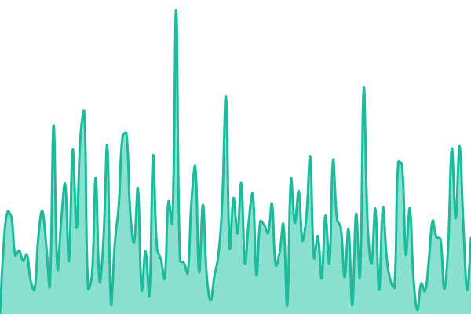 387ms
     
 | 

<a href="https://TW641.github.io/status/history/tw-641-surge-sch-cake">100.00%</a>
    

|  [TW641 Surge 備援網站 - padavan-builder-workflow](https://tw641.surge.sh/padavan-builder-workflow/) | 🟩 Up | [tw-641-surge-padavan-builder-workflow.yml](https://github.com/TW641/status/commits/HEAD/history/tw-641-surge-padavan-builder-workflow.yml) | 

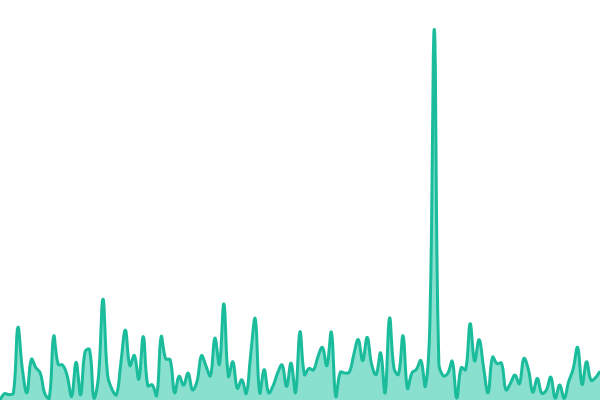 371ms
     
 | 

<a href="https://TW641.github.io/status/history/tw-641-surge-padavan-builder-workflow">100.00%</a>
    

|  [TW641 Surge 備援網站 - padavan-ng](https://tw641.surge.sh/padavan-ng/) | 🟩 Up | [tw-641-surge-padavan-ng.yml](https://github.com/TW641/status/commits/HEAD/history/tw-641-surge-padavan-ng.yml) | 

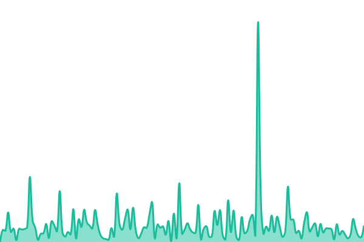 397ms
     
 | 

<a href="https://TW641.github.io/status/history/tw-641-surge-padavan-ng">100.00%</a>
    

|  [TW641 Surge 備援網站 - padavan-4.4](https://tw641.surge.sh/padavan-4.4/) | 🟩 Up | [tw-641-surge-padavan-4-4.yml](https://github.com/TW641/status/commits/HEAD/history/tw-641-surge-padavan-4-4.yml) | 

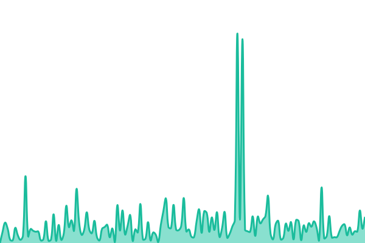 382ms
     
 | 

<a href="https://TW641.github.io/status/history/tw-641-surge-padavan-4-4">100.00%</a>
    

<!--end: status pages-->

[**Visit our status website →**](https://TW641.github.io/status)

## 📄 License

- Powered by: [Upptime](https://github.com/upptime/upptime)
- Code: [MIT](./LICENSE) © [Anand Chowdhary](https://anandchowdhary.com)
- Data in the `./history` directory: [Open Database License](https://opendatacommons.org/licenses/odbl/1-0/)
